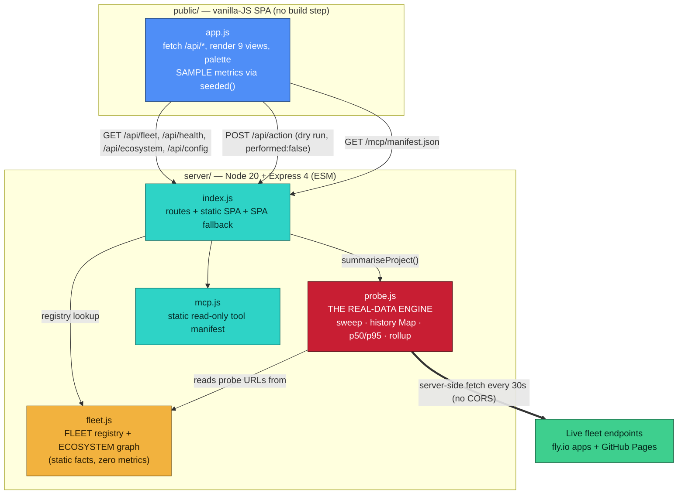

# Helm — CONTEXT.md

> Exhaustive project context for an external AI assistant (e.g. Parakeet) helping Abheet prepare for interviews about this project. Everything below is grounded in the real code in this repository. Nothing is invented; where something is a placeholder or not-yet-built, it is called out as such, because honesty about scope is the defining feature of this project.

---

## 1. What Helm is (the problem it solves)

Abheet built a **seven-project portfolio ecosystem** (Zeno, Weft, Vantage, glass, HealthFlow, Textify, ShieldAI). Once you have seven deployed things, the practical problem is: *are they all up right now, how fast are they, and how do they relate to each other?* Opening seven fly.io dashboards is not an answer.

**Helm is the ops and observability command center over all seven.** It is a single-page web console, patterned on tools like Grafana / Datadog / Vercel / BetterStack / Linear / Raycast (icon rail, top status bar, dense sparkline cards, a `⌘K` command palette). A small Node/Express server probes each live service **server-side**, measures real latency, keeps a rolling history, and serves it to a vanilla-JS SPA.

The **core design principle is honesty**: only measured numbers are presented as real; everything not yet instrumented is labelled `SAMPLE` with a note on how to wire the real source; deploy actions are a **dry run** that show the exact command and execute nothing. This is the project's differentiator — it demonstrates engineering judgment, not just feature count.

---

## 2. Tech stack (exact)

- **Server:** Node 20+, Express 4, ES modules (`"type": "module"` in package.json). Files: `server/index.js`, `server/fleet.js`, `server/probe.js`, `server/mcp.js`.
- **Client:** A single-page app in **vanilla ES modules** — no framework, no build step, no bundler, no runtime network dependency beyond Helm's own JSON APIs. File: `public/app.js` (~1100 lines). Markup: `public/index.html`. Styles: `public/styles.css`.
- **Design system:** `glass` — a framework-neutral CSS design system vendored into `public/vendor/glass/` (tokens, primitives, navigation, feedback, data, forms, workspace, plus a `helm` theme). Uses OKLCH color tokens.
- **Charts:** Hand-drawn inline SVG. **No chart library** (zero dependencies, CSP-clean, theme-aware).
- **Deploy:** Docker (`Dockerfile`) to fly.io (`fly.toml`: app `helm-abheet`, region `sin`, health check on `/health`, internal port 8080). Live at `https://helm-abheet.fly.dev`.
- **Interface:** An MCP manifest at `/mcp/manifest.json` describing read-only fleet tools.

---

## 3. Architecture and data flow

**Boot sequence (`server/index.js`):** on `app.listen`, `startProbing()` runs. It performs one `sweep()` immediately and then sets a 30 s interval (the timer is `unref()`'d so it never keeps the process alive on its own).

**A sweep (`server/probe.js`):** iterates every project's every probe URL, fires one concurrent `fetch` per URL via `probeOnce()`, and records the result. `probeOnce()` uses an `AbortController` with a 9 000 ms timeout (fly machines cold-start, so a short timeout would false-positive as "down"). Each sample is `{ t, ok, ms, code, error }`:
- `ok = res.status < 400` — any 2xx/3xx is up.
- A 4xx/5xx is a real response but `ok:false` → "down" (latency still valid).
- A network error or timeout → `code:0`, `ok:false` → "down".

**History:** `Map<projectId, Map<probeName, Array<sample>>>`, capped at 60 samples per probe (~30 minutes at 30 s cadence). In-memory only — resets on restart.

**Serving the fleet (`/api/fleet`):** merges the static registry (`fleet.js`) with a live rollup from `summariseProject()`:
- `summariseProbe()` → status, code, latency, uptime %, p50, p95, and a `spark` series for the sparkline.
- `summariseProject()` aggregates a project's probes **worst-case**: status is "down" if *any* probe is down, "up" only if *all* are up, "unknown" if never sampled; latency = max across probes, uptime = min, p95 = max. A project with no probes (Zeno) is `local`.
- Percentiles: `sortedMs[floor((p/100) * length)]` over successful latencies.

**The SPA (`public/app.js`):** fetches `/api/fleet`, `/api/ecosystem`, `/api/config` on boot; renders nine views; polls `/api/fleet` every 30 s (interval from `/api/config`), re-rendering only the data-driven views. Hash routing (`#/section/project`). A `⌘K` command palette indexes every section, project, live URL and dry-run action.

**The dry-run action (`/api/action`):** given `{projectId, action}` (`deploy`/`rollback`/`restart`/`logs`), it constructs the real command for the project's deploy target but always returns `performed: false, dryRun: true, wouldRun: "<command>"`. It never touches the fleet.

```
Browser (public/app.js)  ──GET /api/fleet──▶  Express (server/index.js)
                          ◀──registry+rollup──   ├─ fleet.js   (static facts)
                                                  └─ probe.js   (real probes, rolling history)
Browser  ──POST /api/action──▶  index.js  ──▶  wouldRun command (performed:false)
Agent    ──GET /mcp/manifest.json──▶  mcp.js  ──▶  4 read-only tool descriptors
```

---

## 4. Code map (file by file)

- **`server/index.js`** (~180 lines) — Express app. Routes: `/health` (Helm's own liveness), `/api/fleet` (registry + rollup), `/api/health` and `/api/health/:id` (real probe data), `/api/ecosystem` (graph), `/mcp/manifest.json`, `/api/action` (dry run), `/api/config` (probe cadence for the SPA). Static file serving + SPA fallback for hash routing. Starts probing on listen.
- **`server/fleet.js`** (~187 lines) — `FLEET` array: the seven projects with id, name, tagline, blurb, accent hex, glass theme, stack, role, live URL, repo, deploy target, `usesGlass`, `mcp`, `probes[]`, and SAMPLE `releases[]`. `FLEET_BY_ID` lookup. `ECOSYSTEM` graph (built-on-glass edges + one Zeno→Vantage MCP edge). Pure static facts; no metrics.
- **`server/probe.js`** (~177 lines) — the real-data engine. `probeOnce`, `sweep`, `summariseProbe`, `summariseProject`, `getFleetHealth`, `startProbing`, `percentile`, `PROBE_CONFIG` (`TIMEOUT_MS 9000`, `HISTORY_MAX 60`, `REFRESH_MS 30000`).
- **`server/mcp.js`** (~59 lines) — `mcpManifest(origin)` returns a static descriptor of four read-only tools mapping to real endpoints. Action tools deliberately excluded.
- **`public/app.js`** (~1100 lines) — the whole SPA. Sections: helpers (`el`, `store`, `seeded`), icons, formatting, charts (`sparkline`, `barChart`, `fleetLatencyChart`, `vitalsChart`), nine views (`viewOverview`…`viewSettings`), theming, dry-run actions + toasts, the `⌘K` palette, shell + hash router, data polling + boot.
- **`public/index.html`** — loads the glass stylesheets then `app.js` as a module; applies saved theme before first paint; `<noscript>` points at the JSON APIs.
- **`README.md`** — the public-facing writeup with Mermaid architecture diagrams.
- **`docs/CRASH_COURSE.md`** — the interview study guide (companion to this file).

---

## 5. The seven projects it watches

| id | Name | What it is | Probe(s) | Deploy |
| --- | --- | --- | --- | --- |
| `zeno` | Zeno | Local-first agent orchestrator (drives Forge sub-agents over open + frontier models) | none → `local` | desktop app |
| `weft` | Weft | Real-time CRDT collaborative editor | `GET /` | fly.io (`weft-abheet`) |
| `vantage` | Vantage | Analytics workspace **+ MCP server** (reference MCP surface) | `GET /health` | fly.io (`vantage-abheet`) |
| `glass` | glass | The shared **design-system foundation** every project is built on | `GET /` (Pages) | GitHub Pages |
| `healthflow` | HealthFlow | Clinical-workflow app, **web + separate API tier** | `GET /` **and** API `GET /health` | fly.io (`healthflow-abheet19`) |
| `textify` | Textify | Document RAG + summariser | `GET /health` | fly.io (`textify-abheet19`) |
| `shieldai` | ShieldAI | Privacy-preserving ML demo | `GET /` | fly.io (`shieldai-abheet19`) |

`glass` is the foundation (centre of the Service Map). `Vantage` exposes MCP; `Zeno` drives it over MCP. HealthFlow is the multi-probe case (only "up" when both tiers answer).

---

## 6. What is REAL vs SAMPLE (be precise about this)

**REAL (measured by the probe engine):** up/down status, HTTP status code, current latency, latency history/sparklines, uptime % over the window, p50/p95. Also real: the **Alerts rules** are evaluated live against real probe data on every refresh — a firing alert is real.

**SAMPLE (labelled placeholders, wiring-ready):** Core Web Vitals (LCP/INP/CLS), error rate, deploy/release history, cost, and the recent-alerts *activity feed*. These use `seeded()` for stable per-project values that don't flicker on re-render, and each panel carries a note on how to wire the real source (a `web-vitals` RUM beacon to `/api/vitals`, fly.io/GitHub for deploy history, an alerting webhook for the feed).

**DRY RUN:** `/api/action` never executes — it returns `performed:false` and the command it would run.

---

## 7. Trending terms explained (glossary)

- **Observability / ops command center** — one place to see the operational state (health, latency, deploys, alerts) of many services at once, instead of many separate dashboards. Helm is this for seven projects.
- **Health probe** — a periodic request to a service's URL to check it responds and how quickly. Helm probes server-side so there's no browser CORS restriction.
- **Server-side (vs client-side) probing** — the measurement happens in the Node backend, not the browser. Browsers can't read another origin's response due to **CORS**; the server can, so latency and status are real and unblocked.
- **CORS (Cross-Origin Resource Sharing)** — the browser security rule that blocks a page from reading responses from a different origin unless that origin opts in. It's why health-checking other sites must happen on the server.
- **Latency** — time from sending the request to getting the response, in milliseconds. Helm measures wall-clock latency around each `fetch`.
- **Percentile (p50 / p95)** — p50 (median) is the middle latency; p95 means 95% of requests were at least this fast (5% were slower). p95 exposes the slow tail that averages hide.
- **Uptime %** — share of probe samples in the rolling window that returned a healthy response. Real but windowed (resets on restart because history is in-memory).
- **Cold start** — a fly.io machine that scaled to zero has to boot on the first request, causing a multi-second spike. Helm gives a 9 s timeout so a cold start isn't misread as "down".
- **Rolling window / rolling history** — Helm keeps only the last 60 samples per probe; metrics are computed over that moving window, not all-time.
- **Sparkline** — a tiny inline line chart (here, latency over recent samples) shown in each project card.
- **Square-root (√) axis** — a non-linear y-axis that compresses large values. It keeps normal-range services readable when one service cold-starts into multi-second latency, while the outlier still reads as the largest.
- **Core Web Vitals (LCP / INP / CLS)** — Google's user-experience metrics. **LCP** (Largest Contentful Paint) = load speed; **INP** (Interaction to Next Paint) = responsiveness; **CLS** (Cumulative Layout Shift) = visual stability. In Helm these are labelled SAMPLE until a real RUM beacon is wired.
- **RUM (Real User Monitoring)** — collecting performance metrics from actual users' browsers (e.g. the `web-vitals` JS library posting to an endpoint), as opposed to synthetic lab tests.
- **Dry run** — an operation that reports exactly what it *would* do without doing it. Helm's deploy/rollback/restart actions are dry runs.
- **MCP (Model Context Protocol)** — an open standard for exposing tools and data to AI agents (like Claude) in a structured, discoverable way. Helm publishes a manifest of four **read-only** fleet tools an agent could call. It's a descriptive manifest today, not a live MCP transport.
- **CRDT (Conflict-free Replicated Data Type)** — a data structure that lets multiple people edit offline and merge deterministically with no conflicts (that's Weft, one of the watched projects).
- **OKLCH** — a perceptually-uniform color space; the glass design system defines its color tokens in OKLCH so themes stay consistent and accessible.
- **CSP (Content Security Policy)** — browser rules restricting what a page can load/run. Helm's hand-drawn SVG charts need no external scripts, so they're "CSP-clean".
- **SPA (Single-Page Application)** — the whole UI runs in one HTML page with client-side routing; Helm uses hash routing (`#/section`) in vanilla JS, no framework.
- **Vendoring** — copying a dependency's files into the repo (glass into `public/vendor/glass/`) so the deployed container is self-contained and pinned, with no runtime fetch to an external host.

---

## 8. Likely interview questions and answers

**Q: Give me the 30-second pitch.**
A cross-project ops dashboard for my seven deployed projects. A Node server probes each service server-side, measures real latency, and keeps a rolling history so up/down, uptime and p95 are all measured. The SPA is vanilla ES modules with hand-drawn SVG charts on a shared design system. Its defining feature is honesty: unmeasured metrics are labelled SAMPLE, and deploy actions are a dry run that show the command and run nothing.

**Q: Why not just use fly.io's dashboard / Grafana / an off-the-shelf tool?**
Those don't unify a heterogeneous set — fly apps, a GitHub Pages site, a local desktop app — into one ecosystem view with the relationship graph. And building it demonstrates I understand what those tools do under the hood: probing, rolling windows, percentiles, dry-run safety.

**Q: How do you know the numbers are real?**
`server/probe.js` does actual `fetch` calls with a 9 s timeout and records `{t, ok, ms, code}`. `/api/health` returns `"real": true`. You can `curl` it and see live latency change. Metrics that aren't measured are explicitly tagged SAMPLE in both the API and the UI — I never dress up a fake number as real.

**Q: Walk me through what happens when a service goes down.**
The next sweep's `fetch` errors or times out → sample `{ok:false, code:0}`. `summariseProbe` reports status "down"; `summariseProject` marks the whole project down (worst-case). Uptime % drops as failed samples enter the window. The Overview card, Health table, Status page and the live Alerts "Endpoint down" rule all reflect it on the next 30 s poll.

**Q: Explain the square-root axis decision.**
Cold-starting fly machines spike to multi-second latency while healthy services sit under 200 ms. On a linear axis that outlier flattens everyone else. A √ scale compresses the tall value while keeping it visibly the largest, so all services stay readable. It's disclosed in the UI wherever used.

**Q: Why is the deploy action fake?**
It's not fake, it's a deliberate dry run. Real deploys need a fly.io token the app doesn't hold. Rather than fake success, `/api/action` returns the exact `fly deploy --app <app>` command and `performed:false`. Wiring a token is the one step to make it real. Honesty about capability over a fake demo.

**Q: How would this scale to 50 projects?**
Move probe history from in-memory to a time-series store (persist samples), stagger sweeps to avoid a thundering herd, add per-probe concurrency limits, and paginate/virtualize the UI grid. The registry is already data-driven, so adding projects is just config.

**Q: What's the MCP piece?**
`/mcp/manifest.json` describes four read-only tools (`list_fleet`, `get_fleet_health`, `get_project_health`, `get_ecosystem_map`) mapping 1:1 to real endpoints, so an agent like Zeno or Claude could query fleet health. Action tools are excluded on purpose. It's descriptive today, not a live stdio/SSE transport — that's the honest scope boundary.

**Q: The assistant — is it an LLM?**
No. `answer()` in `app.js` is fully client-side: it matches the question against a facts base plus live probe state and returns an honest "I don't have a grounded answer" when it can't. No model call, so no hallucination risk.

**Q: What are the current limitations / what would you do next?**
Probe history is in-memory (resets on restart) — persist it. Web Vitals, error rate, deploy history and the alert feed are SAMPLE — wire a `web-vitals` RUM beacon (Vantage analytics as first source), fly.io/GitHub APIs, and an alerting webhook. Wrap the MCP manifest in a live transport. Add a real fly.io token to turn the dry-run actions live.

**Q: Why vanilla JS and hand-drawn charts instead of React + a chart library?**
No build step, no dependencies, tiny payload, zero CSP exceptions, and the charts read the same OKLCH design tokens as the rest of the UI so theming is automatic. For a dashboard of this size it's the right amount of tooling — and it proves I can build without leaning on a framework.

---

## 9. One-line summary

Helm is an honest, real-probing ops and observability command center for a seven-project ecosystem — vanilla-JS SPA, Node/Express probe backend, hand-drawn SVG charts, a read-only MCP manifest, and dry-run deploy actions — where every metric is either measured or clearly labelled as a placeholder.

---

## Annotated core code + knowledge graph

> Appended for the interview-assist AI: a structural map plus the 1-3 most important real code excerpts (verbatim from `server/`), each with line-by-line comments and an interviewer Q&A. Everything here quotes the actual source — real file, function and variable names, nothing invented.

### Knowledge graph / structure summary

Helm has exactly one source of live truth (`server/probe.js`) sitting behind a thin Express layer (`server/index.js`) that merges it with static facts (`server/fleet.js`). The client (`public/app.js`) only ever reads Helm's own JSON. The honesty invariant lives at the seam: `probe.js` produces **REAL** numbers; everything labelled **SAMPLE** is generated client-side by `seeded()` and never touches the probe engine.



**One line per file that matters:**

- `server/probe.js` — the only live-data source: server-side `fetch` probes, per-probe rolling history (`Map<projectId, Map<probeName, sample[]>>`, capped at 60), and the `percentile`/`summariseProbe`/`summariseProject` math for uptime + p50/p95.
- `server/fleet.js` — `FLEET`: the seven projects as hand-verified static metadata, each carrying its `probes[]` (the URLs `probe.js` hits) and SAMPLE `releases[]`; plus `FLEET_BY_ID` and the `ECOSYSTEM` edge graph.
- `server/index.js` — Express wiring: serves the SPA, exposes `/api/fleet` (registry joined with the live rollup), `/api/health[/:id]`, `/api/ecosystem`, `/api/config`, `/mcp/manifest.json`, and the dry-run `/api/action`; calls `startProbing()` on listen.
- `server/mcp.js` — `mcpManifest(origin)`: a static descriptor of four **read-only** tools that map 1:1 onto the real endpoints (action tools deliberately omitted).
- `public/app.js` — the whole SPA; reads Helm's JSON, draws hand-rolled SVG charts, and is where every SAMPLE value is deterministically generated via `seeded()` and tagged in the UI.

**Data/control flow in one sentence:** `startProbing()` → `sweep()` fans out one `probeOnce()` per URL in `FLEET` → each `{t, ok, ms, code, error}` sample is pushed into the rolling `history` map → a request to `/api/fleet` calls `summariseProject()`, which folds each probe's history into status/uptime/p50/p95 and rolls the probes up worst-case → the SPA polls that every 30 s.

### Excerpt 1 — `probeOnce()`: one real measurement with a hard timeout (`server/probe.js`)

This is the atom of everything real in Helm: a single wall-clock-timed `fetch` with an abort timeout, classified into up / erroring / down. Quoted verbatim from `server/probe.js` (lines 40-64).

```js
async function probeOnce(url, method = 'GET') {
  const started = Date.now();                                    // start the wall clock BEFORE the request
  const controller = new AbortController();                      // lets us cancel a request that hangs
  const timer = setTimeout(() => controller.abort(), TIMEOUT_MS); // 9s ceiling so a cold start is not "down"
  try {
    const res = await fetch(url, {
      method,
      redirect: 'follow',                                        // follow 3xx so a redirect is not miscounted
      signal: controller.signal,                                 // wire the abort controller to this fetch
      headers: { 'user-agent': 'Helm-fleet-probe/1.0 (+https://helm-abheet.fly.dev)' } // honest, identifiable UA
    });
    const ms = Date.now() - started;                             // measured latency = response time − start
    return { t: Date.now(), ok: res.status < 400, ms, code: res.status, error: null }; // any 2xx/3xx = up
  } catch (err) {
    const ms = Date.now() - started;                             // still record how long we waited before failing
    const aborted = err?.name === 'AbortError';                  // distinguish our timeout from a network error
    return {
      t: Date.now(),
      ok: false,
      ms,
      code: 0,                                                   // 0 = no HTTP response at all (down)
      error: aborted ? `timeout after ${TIMEOUT_MS}ms` : String(err?.cause?.code || err?.message || err)
    };
  }
}
```

**Interviewer might ask — "Why an `AbortController` instead of `Promise.race` with a timeout?"** `fetch` has no built-in timeout, and a `Promise.race` would *resolve* the race but leave the real request hanging in the background (a socket leak, and it could still fire callbacks). `AbortController` actually cancels the underlying request. The 9 s value (`TIMEOUT_MS`) is deliberate: fly.io machines scale to zero and cold-start for several seconds, so a tight 1-2 s timeout would report a healthy-but-sleeping app as "down" — a false negative I explicitly designed against.

**"Why is `code: 0` meaningful?"** It separates *reachable-but-erroring* (a real 4xx/5xx: `ok:false`, but latency is still valid) from *unreachable* (network error/timeout: `code:0`). Both are "down" for status, but only the former proves the host answered — useful when explaining an outage.

### Excerpt 2 — `percentile()` + rolling p50/p95/uptime (`server/probe.js`)

The math that turns raw samples into the honest headline numbers. Kept deliberately simple — nearest-rank percentile, no interpolation, no dependency. Verbatim from `server/probe.js` (lines 88-116, trimmed to the crux).

```js
function percentile(sortedMs, p) {
  if (!sortedMs.length) return null;                             // no successful samples yet → null (UI shows "—")
  const idx = Math.min(sortedMs.length - 1,                      // clamp so p95 of a tiny array cannot overflow
                       Math.floor((p / 100) * sortedMs.length)); // nearest-rank index into the SORTED array
  return sortedMs[idx];
}

function summariseProbe(projectId, probe) {
  const series = seriesFor(projectId, probe.name);               // this probe's rolling history (≤ 60 samples)
  const latest = series[series.length - 1] || null;             // newest sample drives current status
  const okSamples = series.filter((s) => s.ok);                 // uptime & percentiles use ONLY healthy samples
  const latencies = okSamples.map((s) => s.ms).sort((a, b) => a - b); // ascending, for nearest-rank percentile
  const uptime = series.length                                  // uptime = healthy / total over the window
    ? Math.round((okSamples.length / series.length) * 1000) / 10 // 1-decimal % (e.g. 99.4); null if never sampled
    : null;
  return {
    name: probe.name, url: probe.url,
    status: latest ? (latest.ok ? 'up' : 'down') : 'unknown',   // unknown until the first sample lands
    code: latest?.code ?? null, latencyMs: latest?.ms ?? null,
    samples: series.length, uptimePct: uptime,
    p50Ms: percentile(latencies, 50), p95Ms: percentile(latencies, 95),
    spark: series.map((s) => ({ t: s.t, ms: s.ok ? s.ms : null, ok: s.ok })) // null on failures = gap in the line
  };
}
```

**Interviewer might ask — "Why nearest-rank percentiles instead of interpolating?"** Over a rolling window of ≤ 60 samples, interpolation adds precision the data does not justify and makes the number harder to explain. Nearest-rank (`sortedMs[floor(p/100 * n)]`) is exactly "the value at the 95% position after sorting" — cheap, dependency-free, and honest about resolution. The `Math.min(length - 1, …)` clamp is the important edge case: it guarantees the index never runs past the end of the array for any p/length combination.

**"Why compute p50/p95 from `okSamples` only?"** A failed probe's `ms` is time-until-failure, not service latency — mixing it in would poison the percentile. Uptime is the metric that counts failures (healthy ÷ total); latency percentiles measure only responses that actually returned. Splitting them keeps each number meaning one thing. **Complexity:** each summarise is O(n log n) for the sort over n ≤ 60 — trivially cheap, and it runs per request, not per sweep.

### Excerpt 3 — `summariseProject()`: worst-case rollup (`server/probe.js`)

How several probes (e.g. HealthFlow's `web` + `api` tiers) collapse into one honest project verdict. Verbatim from `server/probe.js` (lines 120-151, trimmed).

```js
export function summariseProject(project) {
  if (!project.probes.length) {                                 // Zeno has no probes (local desktop app)
    return { id: project.id,
             status: project.deploy?.target === 'local' ? 'local' : 'unknown',
             latencyMs: null, uptimePct: null, p95Ms: null, checkedAt: null, probes: [] };
  }
  const probes = project.probes.map((p) => summariseProbe(project.id, p));
  const anyDown = probes.some((p) => p.status === 'down');      // one dead tier = project down
  const allUp = probes.every((p) => p.status === 'up');        // "up" only if EVERY probe is up
  const anyUnknown = probes.some((p) => p.status === 'unknown');
  const status = anyUnknown && !anyDown ? 'unknown'             // still warming up, nothing failing
               : anyDown ? 'down'                               // worst-case wins
               : allUp ? 'up' : 'degraded';                     // mixed known-states = degraded
  const lat = probes.map((p) => p.latencyMs).filter((n) => n != null);
  const up  = probes.map((p) => p.uptimePct).filter((n) => n != null);
  const p95 = probes.map((p) => p.p95Ms).filter((n) => n != null);
  return { id: project.id, status,
           latencyMs: lat.length ? Math.max(...lat) : null,     // report the WORST latency across tiers
           uptimePct: up.length ? Math.min(...up) : null,       // report the LOWEST uptime
           p95Ms: p95.length ? Math.max(...p95) : null,         // report the WORST tail
           checkedAt: /* max sample time across probes */ null, probes };
}
```

**Interviewer might ask — "Why worst-case (max latency / min uptime) instead of averaging the tiers?"** Because a project is only as healthy as its weakest dependency. If HealthFlow's web tier is fast but its API is down, averaging would show a misleadingly "half-healthy" project; taking the max latency / min uptime / any-down status tells the operator the truth — the user-facing experience is broken. It mirrors how real SLO rollups treat a multi-component service. The `local`/`unknown` branch keeps Zeno honest: it is a desktop app with no endpoint, so it is reported as `local`, never faked as "up".
