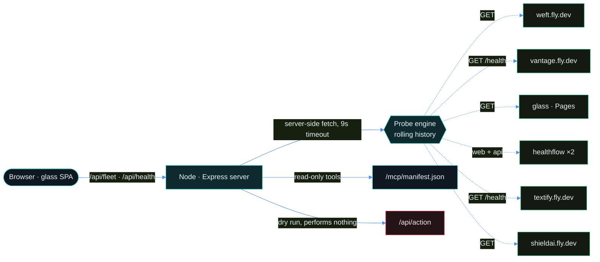
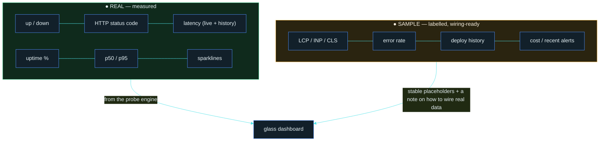

<div align="center">


# Helm

### Operations visibility for the seven-product fleet in this eight-project portfolio

Real health probes and latency history · clearly labelled RUM and deployment placeholders · one fleet map.

<br/>

[](https://helm-abheet.fly.dev)
[](#honesty)
[](https://abheet19.github.io/glass/)
[](https://fly.io)

<br/>


</div>

---

## What Helm is

**Helm** is the cross-project **ops and observability console** for the other seven products in this portfolio. Its Node server probes public endpoints and its glass interface turns those measurements into fleet health, latency history, alerts, and a service map. Operator actions and browser RUM are visible integration surfaces, but remain dry runs or labelled samples until credentials and telemetry are connected.

It is not a mockup. A small Node server **probes each live service server-side** (no browser, so no CORS), measures real latency, and keeps a rolling window so uptime, p50/p95 and the sparklines are computed from **actual measurements**. Where a metric is not instrumented yet (Core Web Vitals, error rate, cost), Helm shows a **clearly-labelled SAMPLE** placeholder with a wiring note — never a fake number dressed up as real. That honesty rule is the whole point.

### The ecosystem it watches

| Project | What it is | Accent | Live | In Helm |
| --- | --- | :---: | --- | --- |
| **Zeno** | Local-first agent orchestrator | 🔴 crimson | *local desktop app* | shown as `local / not web-deployed` |
| **Weft** | Real-time CRDT editor | 🟢 teal | [weft-abheet.fly.dev](https://weft-abheet.fly.dev) | probed |
| **Vantage** | Analytics workspace **+ MCP** | 🟡 gold | [vantage-abheet.fly.dev](https://vantage-abheet.fly.dev) | probed (`/health`) |
| **glass** | The shared **design system** | 🟢 teal | [abheet19.github.io/glass](https://abheet19.github.io/glass/) | probed · **foundation** |
| **HealthFlow** | Clinical workflow (web + API) | 🟢 green | [healthflow-abheet19.fly.dev](https://healthflow-abheet19.fly.dev) | probes **both** web & API |
| **Textify** | Document RAG + summariser | 🟠 amber | [textify-abheet19.fly.dev](https://textify-abheet19.fly.dev) | probed (`/health`) |
| **ShieldAI** | Privacy-preserving ML | 🔵 blue | [shieldai-abheet19.fly.dev](https://shieldai-abheet19.fly.dev) | probed |

`glass` is the visual foundation every project (Helm included) is built on; **MCP** is the connective tissue Zeno and Helm drive the products through. That is the ecosystem — not seven islands.

---

## Architecture



- **Node server** (`server/`) — serves the SPA, runs the probe loop, exposes the JSON APIs and the MCP manifest, and answers actions with an honest **dry run**.
- **SPA** (`public/`) — vanilla ES modules, **no build step, no runtime network dependency** beyond Helm's own APIs. Charts are hand-drawn inline SVG (CSP-clean, no chart library).
- **glass** — the design system is vendored into `public/vendor/glass/`, driven by a Helm theme (signal cyan + command blue). Glass material lives only on the rail, top bar and overlays; all content surfaces are opaque, per glass's contrast law.

### Data flow: what's real



Note one deliberately-real exception in the SAMPLE zone: the **Alerts** rules are evaluated **live** against the real probe data, so a firing alert there is real — only the *historical* alert feed is sample.

---

## The console

Ten ops flows, all reachable from the rail and from `⌘K`:

1. **Overview** — the fleet grid: up/down, latency, p95, a real-latency sparkline, stack, live link and deploy freshness per project.
2. **Performance / Web-Vitals** — real p95-latency and uptime bar charts; a Core-Web-Vitals table labelled SAMPLE.
3. **Health** — every probed endpoint with its last status code, latency and time of last check.
4. **Deploys** — a releases timeline + one-click **Deploy / Rollback / Restart / Logs** — a **dry run** that shows the exact `fly` command and runs nothing.
5. **Alerts** — live rule evaluation (real) + a sample activity feed.
6. **Service Map** — the ecosystem graph: glass at the centre, MCP links, live status rings.
7. **Status** — a clean, public-style status page generated from real probes.
8. **Assistant** — a `⌘K`-reachable, fully client-side assistant grounded in a facts base + the live probe data; it says so when it doesn't know.
9. **⌘K palette** — jump to any section/project, open a live URL, or run an action.
10. **Settings** — live theme + reduce-transparency controls; fly.io / GitHub / RUM integration placeholders.

<details>
<summary><b>Design decisions</b></summary>

- **Why vendor glass instead of importing it?** So the deployed container is self-contained and pinned — no runtime fetch to GitHub Pages, and the exact tokens ship with the app.
- **Why hand-drawn SVG charts?** Zero dependencies, zero CSP exceptions, tiny payload, perfect theme-awareness (charts read the same OKLCH tokens as everything else).
- **Why is `/api/action` a dry run?** Because Helm should be honest about capability. Real deploys need a fly.io token the app doesn't have; rather than pretend, it returns the command it *would* run and performs nothing. Wiring a token in Settings is the single step to make it real.
- **Why probe server-side?** Browsers can't measure another origin's health without CORS. The server can, so up/down and latency are real and unblocked.
</details>

<details>
<summary><b>What it does not do yet</b></summary>

- No real fly.io / GitHub integration — deploy history, cost and live actions are stubbed until a token is connected.
- Core Web Vitals, error rate and the recent-alerts feed are SAMPLE placeholders (clearly labelled) until a RUM beacon / alerting webhook is wired.
- Probe history is in-memory (resets on restart); persist it to a store for long-window uptime.
- The MCP manifest is a descriptive document mapping to the read-only HTTP endpoints; it is not yet wrapped in a live stdio/SSE MCP transport.
</details>

---

## Run it

```bash
npm install
npm start                 # http://localhost:8080
```

Then:

```bash
curl localhost:8080/health              # Helm's own liveness
curl localhost:8080/api/health          # REAL probes of every project
curl localhost:8080/api/fleet           # registry + live rollup
curl localhost:8080/mcp/manifest.json   # read-only fleet tools
```

The probe loop runs one sweep on boot and then every 30s; the sparklines and uptime fill in as history accrues.

## Deploy (fly.io)

```bash
fly apps create helm-abheet
fly deploy                # uses Dockerfile + fly.toml (app = helm-abheet, region = sin)
```

Health check hits `/health`; the app binds `PORT` (8080).

---

## API

| Endpoint | Method | Returns |
| --- | --- | --- |
| `/health` | GET | Helm's own liveness |
| `/api/health` | GET | real probe results for the whole fleet |
| `/api/health/:id` | GET | real probe results for one project |
| `/api/fleet` | GET | registry + live status rollup |
| `/api/ecosystem` | GET | the service/stack graph |
| `/api/action` | POST | **dry run** — the command it would run (never executes) |
| `/mcp/manifest.json` | GET | read-only MCP fleet tools |

<a name="honesty"></a>
## Honesty

> Every up/down, latency, uptime and percentile in Helm is **measured**. Everything not yet measured is **labelled SAMPLE** with a note on how to make it real. Actions are a **dry run** and perform nothing. This is the same ethos the rest of the ecosystem is built to.

---

<div align="center">

Built on [**glass**](https://abheet19.github.io/glass/) · the operations project in an eight-project portfolio.

</div>
